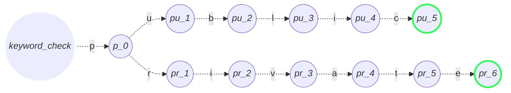
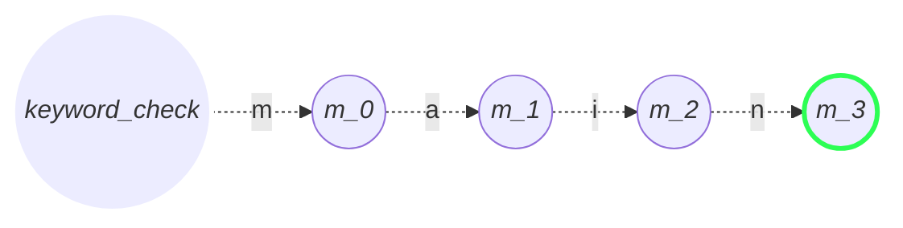
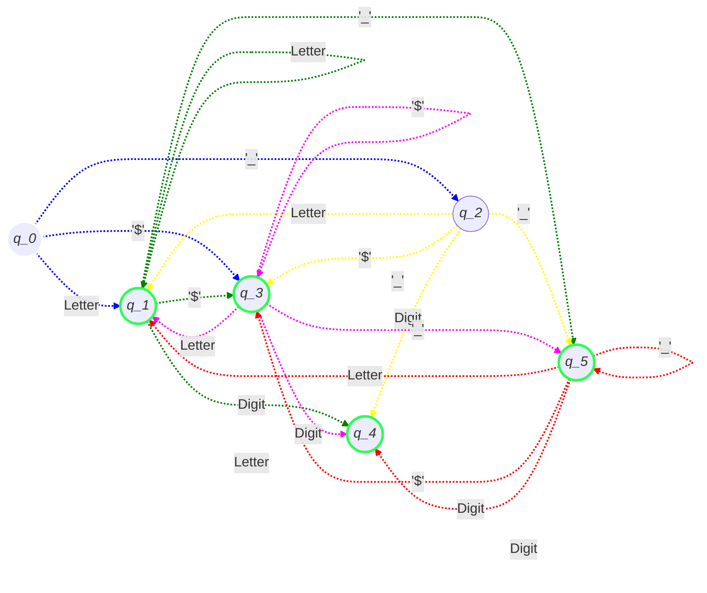

# dfa_java
A dfa programmed in prolog that identifies any valid java 
variable name.

## Rules
- Can contain letters, digits, underscores, and dollar signs
- Must begin with a letter, '$' or  '_'
- Cannot contain whitespace
- Cannot contain special characters besides underscores, and dollar signs
- Cannot be a single underscore
- Cannot start with a digit
- Cannot be a reserved keyword

## States

This DFA has the following states:

### $q_0$ 
- Initial state. 
- No inputs have been made and thus, it is not a valid state.

### $q_1$ 
- **Valid state** where the variable has a name, such as 'a' or 'A'. Any number of inputs of alphabetic characters will loop this state.

### $q_2$
- '_' at the beginning. 

### $q_3$ 
- **Valid state**. 
- '$' at the beginning.
- Java allows '$' as a valid identifier on its own. 

### $q_4$
- **Valid state**. 
- This state is reached when there is a number in the variable name. 


### $q_5$
- **Valid state**. 
- Java allows '__' as a valid identifier on its own.
- This state is necessary to differentiate when there is a single underscore at the beginning or multiple ones. 

## Regex 
`^(?!_$)[a-zA-Z$_][a-zA-Z\d_$]*$`
### Breakdown
- `^(?!_$)` means to make sure that the first position "^", by looking ahead "?" that there is NOT "!" a single "_" that simply ends "$".
- `[a-zA-Z$_]` means any character in the range of a-z or A-Z or "$" or "_".
- `[a-zA-Z\d$_]*` means any character mentioned previously or any digit "\d" or "$" or "_". The asterisk (star operator) means there can be from 0 to any number of the characters stated in the group enclosed by brackets.
- Finally the $ just means this is the end of the string.

### Examples of valid identifiers
```
$astrid
$$aa
a$A$a$_
A$a
$as1111
$____$$$$
$$$as$$
$_
$
a_
_a
_9
_$
__
```

### DFA chart for keywords

Every reserved keyword could have its own DFA so I chose 5 keywords, where some of these overlap and some don't.

The list of used keywords is as follows:

- public
- private
- main
- void
- int

#### public & private keywords



#### main keyword



### DFA chart for valid identifiers

- Q0 represents the initial state
- Accepting states are defined in thick blue outline:
  - Q1, Q3, Q4, Q5
- Letter represents any alphabetic character, regardless of capitalization

