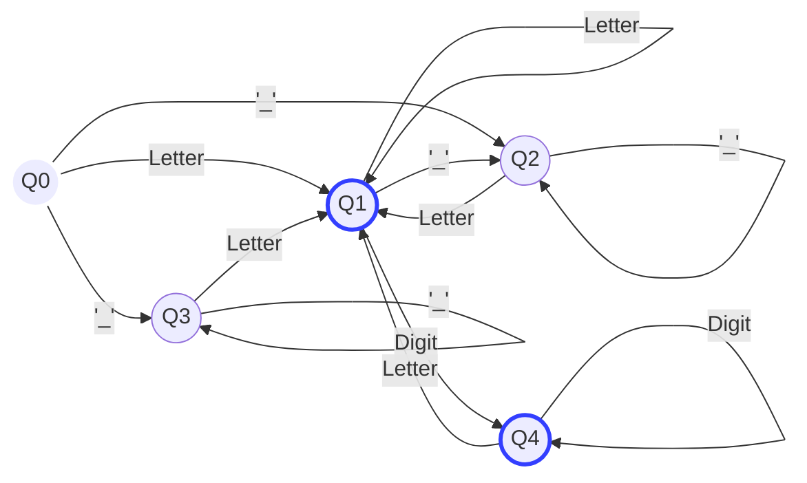

# dfa_java
A dfa programmed in prolog that identifies any valid java 
variable name.

## Rules
- Can contain letters, digits, underscores, and dollar signs
- Must begin with a letter, '$' or  '_'
- Cannot contain whitespace
- Cannot contain special characters besides underscores, and dollar signs

## States

This DFA has the following states:

### $q_0$ 
- Initial state. 
- No inputs have been made and thus, it is not a valid state.

### $q_1$ 
- **Valid state** where the variable has a name, such as 'a' or 'A'. Any number of inputs of alphabetic characters will loop this state.

### $q_2$
- '_' at the beginning. 

### $q_3$ 
- '$' at the beginning. 

### $q_4$
- **Valid state**. 
- This state is reached when there is a number in the variable name. 

## Diagram

