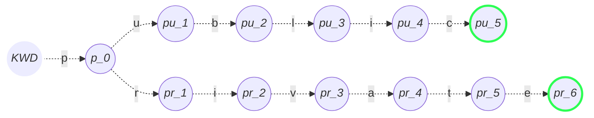
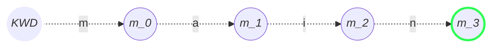
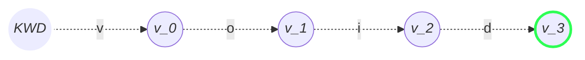
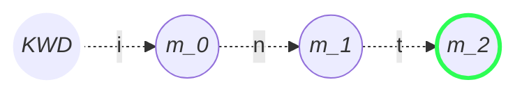
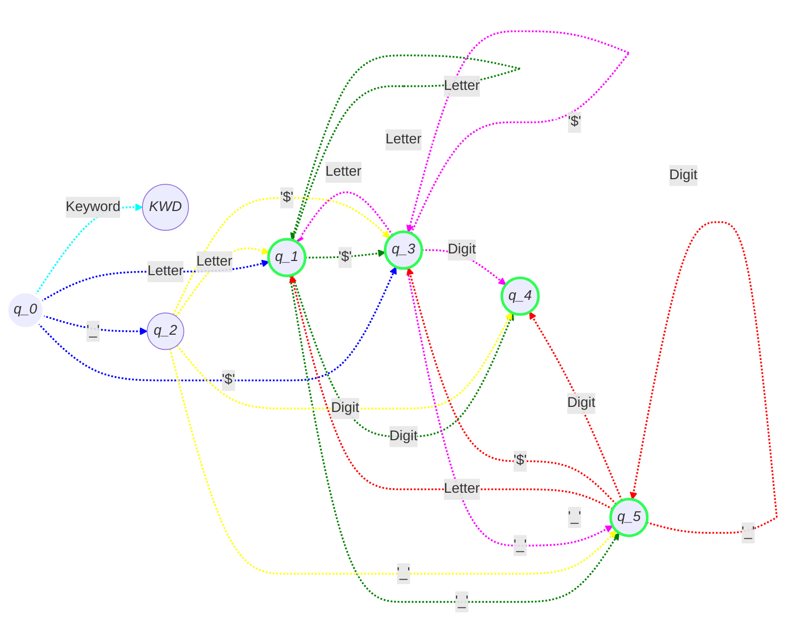

# dfa_java
# Description
A dfa programmed in prolog that identifies any valid java variable name. It is important to note that I made several DFA's to identify some keywords *first* so technically, every string that is being processed starts at the $K$ state that checks for a common letter vocabulary.

This is important to note because *prolog* works on a *closed world assumption*. This implies if something is not known in the database, it will be *false* (this is known as *negation as failure* or *NAF*[^1]). 

> "[...] To show that P is _false_ we do an exhaustive search for a proof of P. If every possible proof fails, ~P is 'inferred. This is the way the both PLANNER (Hewitt [1972]) and PROLOG (Rousseld [1975], Warren et al. [1977]) handle negation"

Keith L. Clark, pg 114[^1] 

I have only defined 5 keywords so any other keywords will be accepted as identifiers because they fall under the general rules for identifiers.

## Rules

The rules used are the valid variable names, not the convention ones, as stated here [^2].

These are the summarized rules for

- Can contain letters, digits, underscores, and dollar signs
- Must begin with a letter, '$' or  '_'
- Cannot contain whitespace
- Cannot contain special characters besides underscores, and dollar signs
- Cannot be a single underscore
- Cannot start with a digit
- Cannot be a reserved keyword

---

# Models

## Automata States

### $q_0$ 
- Initial state. 
- No inputs have been made and thus, it is not a valid state.
- If the first input belongs in the kwd_alphabet $= ['p','m','v','i','P','M','V','I']$. it will transition to the $K$ state

### $K$
- The "K" state is a keyword checking state, where other automata check if the string is a keyword first.
- Every keyword automata starts in this state.

### $q_1$ 
- **Valid state** where the variable has a name, such as 'a' or 'A'. Any number of inputs of alphabetic characters will loop this state.

### $q_2$
- '_' at the beginning. 

### $q_3$ 
- **Valid state**. 
- '$' at the beginning.
- Java allows '$' as a valid identifier on its own. 

### $q_4$
- **Valid state**. 
- This state is reached when there is a number in the variable name. 


### $q_5$
- **Valid state**. 
- Java allows '__' as a valid identifier on its own.
- This state is necessary to differentiate when there is a single underscore at the beginning or multiple ones. 

## Regex 
There is a `regex_test.py` file that tests the regex expression that represents the implemented dfa. The regex capture group will match strings even when separated by any whitespace, whereas the DFA will fail at the presence of any whitespace. 

### Valid variable name Regex
`^[a-zA-Z$]|[_]+[a-zA-Z\d_$]+$`

#### Breakdown
- `^[a-zA-Z$]` String can begin " ^ " with any alphabetic character or the dollar sign
- `|[_]+` OR match if there's one or more underscores
- `[a-zA-Z\d_$]+$` followed by a sequence that ends in any number of alphanumeric characters, underscores or dollar signs at least once
  
### Keyword  Regex
`(\bmain\b)|(\bvoid\b)|(\bint\b)|(\bprivate\b)|(\bpublic\b)`

#### Breakdown
- `\b` indicates a word boundary
- So basically it looks for the pattern of each of the capture groups (the keywords)
- Keywords are *case insensitive*

### DFA chart for keywords

Every reserved keyword could have its own DFA so I chose 5 keywords, where some of these overlap and some don't.

The list of used keywords is as follows:

- public
- private
- main
- void
- int

It is important to note common characteristics to these DFA's:
- Any transition not displayed in these will take you to the DFA for valid identifiers.
- The transitions are case insensitive, meaning "public" or "Public" will both be a keyword state. 

#### public & private keywords



#### main keyword


#### void



#### int



### DFA chart for valid identifiers

- Q0 represents the initial state
- K represents the initial state for the keyword automata
- Accepting states are defined in thick green outline:
  - Q1, Q3, Q4, Q5
- Letter represents any alphabetic character, regardless of capitalization


# Tests

## Examples of valid identifiers
```
$astrid
$$aa
a$A$a$_
A$a
$as1111
$____$$$$
$$$as$$
$_
$
a_
_a
_9
_$
__
```

## Examples of keywords
```
public
Public
pUblIc
main
int
inT
iNT
INT
void
private
public
voiD
mAin
```

## Running tests
Simply feed the `tests` file to prolog as such: `prolog < tests`. 
Each test is concatenated so that in each section they all succeed or fail.

The regex tests can be run just by executing the `regex_test.py` file which will test several cases. 

There is also an added shell script named `get_java_identifiers.sh` which scraps the java reserved words and generates the `kwds.txt` file, in case they remove or add any new keywords as well.

# Analysis
## Complexity
The overall complexity of this is $O(n)$ because the program goes state by state (char by char) on all cases.

Since prolog works on a *NAF* basis, it will attempt to find any valid path. I made a kwd_alphabet $= ['p','m','v','i','P','M','V','I']$ so that only the initial character is compared against those and later just jump to the corresponding state.

## Other algorithms
KMP has to pre-process as well, but unlike the automaton, KMP has to construct the LPS *for every single keyword AND rule*, while the DFA requires constructing *once* and can do it for any string to search for. KMP would have to make the LPS array, which takes $O(k)$ where $k$ is the length of the pattern, append it to the string of length $n$ and look through it in linear time, so $O(k+n)$ [^3]. The construction for the DFA can be quite expensive, but for short pattern matching on short strings, it will always outperform KMP.

For this particular example we would have to run KMP 5 times (one for each keyword listed), against each input. We would be basically end up doing a cartesian product of all possible combinations of the rules plus keywords compared against every single new string that enters through the KMP algorithm.

Construction time for the DFA can be pretty bad, but for this case it is *technically constant* since it is done only once. Let's assume we have a bad algorithm to produce the states, where we have to generate each branching state, where it would approximate $O(2^n)$. As an example, let's use the 5 keywords defined. Those amount to 24 nodes. $(2^{24})$ in time plus the length of all the input strings. Let us think of a Java program like Minecraft. Let's say that we want to look for those 5 keywords in all the source code, and assume the size is the one reported by the java decompiler by [this user on Quora](https://www.quora.com/How-many-lines-of-code-are-there-in-Minecraft) at around 300k. Let's assume each line has around 70 characters. Just for the 5 keywords listed, we would have a value of 70 * 300,000 * 5 = 105,000,000 which is *significantly larger* than 16,777,216 + 21,000,000. This is just for 5 keywords, ignoring the keyword size and assuming we aren't looking for *any* other pattern. 

There is an empirical test added called `timed_tests.py` where the time increase is quite noticeable given the keyword input size using regex (also one time pre-processing) vs KMP 

## References
[^1]: Clark, Keith (1978). ["Negation as a failure"](http://www.doc.ic.ac.uk/~klc/NegAsFailure.pdf). Logic and Data Bases. Springer-Verlag. pp. 114. http://www.doc.ic.ac.uk/~klc/NegAsFailure.pdf

[^2]: Oracle Corporation. (2022). Variables. [Java Tutorial]. Retrieved March 11, 2024, from [docs.oracle.com/javase/tutorial/java/nutsandbolts/variables.html](https://docs.oracle.com/javase/tutorial/java/nutsandbolts/variables.html)

[^3]: Lang, H.W. (2023). Knuth-Morris-Pratt Algorithm. Retrieved from [https://hwlang.de/algorithmen/pattern/kmpen.htm](https://hwlang.de/algorithmen/pattern/kmpen.htm) 
